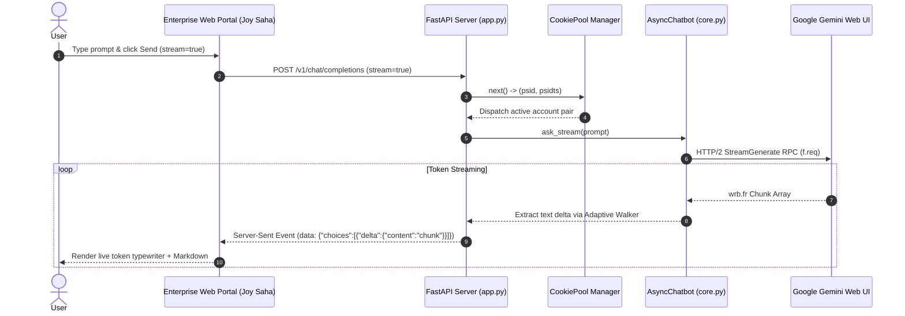

# Full System Architecture & Comprehensive Documentation — Gemini Unofficial API

Created & Maintained by **[Joy Saha](https://sahajoy.vercel.app/)**  
🌐 Portfolio: **[sahajoy.vercel.app](https://sahajoy.vercel.app/)** | 📦 GitHub: **[joy24-student/gemini](https://github.com/joy24-student/gemini.git)**

---

## 1. Executive Summary & Project Overview

The **Gemini Unofficial API** package (`gemini_client`) is a high-performance Python and JavaScript library designed to interact with Google Gemini's Web UI (`gemini.google.com`) **100% unofficially**, requiring **zero official Google AI Studio API keys**.

It reverse-engineers the web interface RPC protocol (`StreamGenerate` and `batchexecute`), using browser session cookies (`__Secure-1PSID` and `__Secure-1PSIDTS`).

### Key Highlights
- **100% Free / Unofficial**: Operates via web session cookies; no paid API keys required.
- **Joy Saha Enterprise Web Portal**: 3-in-1 web application featuring a 100% pixel-perfect Gemini Chat UI, interactive AI Studio playground, and developer documentation portal.
- **Multi-Account Cookie Pool**: Load balance requests across unlimited Google accounts with round-robin dispatch, rate-limit tracking, and automatic failover (`gemini_client.cookie_pool.CookiePool`).
- **Extended Thinking Reasoning Trace**: Support for expandable step-by-step thinking drawers for `gemini-2.0-flash-thinking` and `gemini-3.0-pro`.
- **Automatic Browser Cookie Extraction**: Automatically retrieves authentication cookies from locally installed browsers (Chrome, Edge, Firefox, Brave).
- **HTTP/2 & Speed Optimization**: Built on `httpx` with connection pooling, `orjson` parsing (3x–5x speedup), pre-compiled regex, and thread-safe lock-protected token refresh.
- **Official SDK-Compatible Response Surface**: Returns `GenerateContentResponse` objects with `.text`, `.candidates`, `.usage_metadata`, and `.parts`.
- **Real-Time SSE Token Streaming**: Stream response chunks live token-by-token using Server-Sent Events.

---

## 2. System Architecture Diagram

```
                                  ┌────────────────────────────────────────────────────────┐
                                  │    GEMINI UNOFFICIAL ENTERPRISE SYSTEM (JOY SAHA)      │
                                  └────────────────────────────────────────────────────────┘
                                                               │
                                         ┌─────────────────────┴─────────────────────┐
                                         ▼                                           ▼
                      ┌────────────────────────────────────┐             ┌───────────────────────────────────┐
                      │    Python Engine (gemini_client)   │             │   Node.js Client (gemini.js)      │
                      └────────────────────────────────────┘             └───────────────────────────────────┘
                                         │
        ┌────────────────────────────────┼────────────────────────────────┬────────────────────────────────┐
        ▼                                ▼                                ▼                                ▼
┌───────────────┐               ┌──────────────────┐             ┌─────────────────┐             ┌──────────────────┐
│  Core Client  │               │ Cookie Pool      │             │ Enterprise Portal│             │  Live Real-Time  │
│  (core.py)    │               │ (cookie_pool.py) │             │ (docs/index.html)│             │ (unofficial_live)│
└───────────────┘               └──────────────────┘             └─────────────────┘             └──────────────────┘
  • Chatbot                       • Multi-Account Pool             • 100% Gemini Chat UI           • Pipeline Session
  • AsyncChatbot                  • Round-Robin Dispatch           • AI Studio Playground          • Playwright Session
  • ask()                         • Rate-Limit Monitor             • Extended Thinking Trace       • Speaker Stream Queue
  • ask_stream()                  • Failover Circuit Breaker       • Multi-Lang Exporter           • Sentence Chunking
```

---

## 3. Real-Time RPC Sequence Diagram (Mermaid.js)



---

## 4. Multi-Account Cookie Pool Configuration

Manage multiple Google accounts in `.env` or `cookies_pool.json`:

```env
# Multi-Account JSON Array in .env
GEMINI_COOKIES_JSON='[{"__Secure-1PSID": "acc1_psid", "__Secure-1PSIDTS": "acc1_psidts"}, {"__Secure-1PSID": "acc2_psid", "__Secure-1PSIDTS": "acc2_psidts"}]'

# OR Cookie Pool File Path
GEMINI_COOKIE_POOL_PATH=/app/cookies_pool.json
```

```python
from gemini_client.cookie_pool import CookiePool

pool = CookiePool.from_file("cookies_pool.json")
psid, psidts = pool.next()
```

---

## 5. Deployment Guide

### Docker VPS Deployment
```bash
docker compose -f docker/docker-compose.yml up -d --build
```

### Vercel Serverless Deployment
```bash
vercel env add GEMINI_1PSID
vercel env add GEMINI_1PSIDTS
vercel --prod
```

---

## 6. License & Credits

- **Author**: **[Joy Saha](https://sahajoy.vercel.app/)**
- **Portfolio**: **[https://sahajoy.vercel.app/](https://sahajoy.vercel.app/)**
- **Repository**: **[https://github.com/joy24-student/gemini.git](https://github.com/joy24-student/gemini.git)**
- **License**: Released under the **[MIT License](LICENSE)**.
